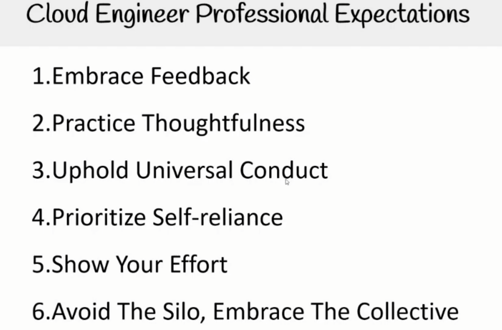
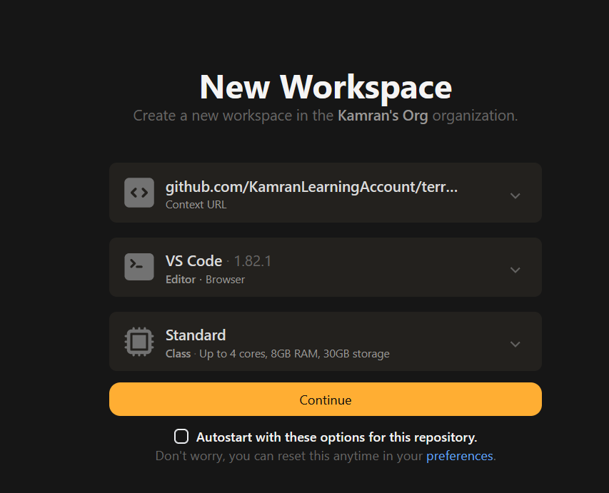
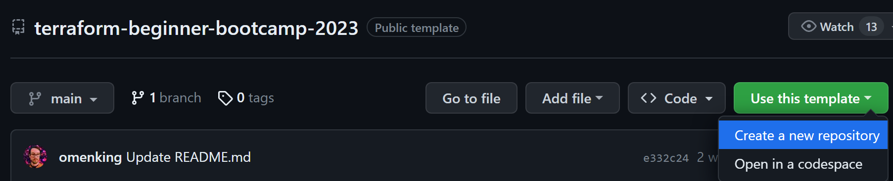
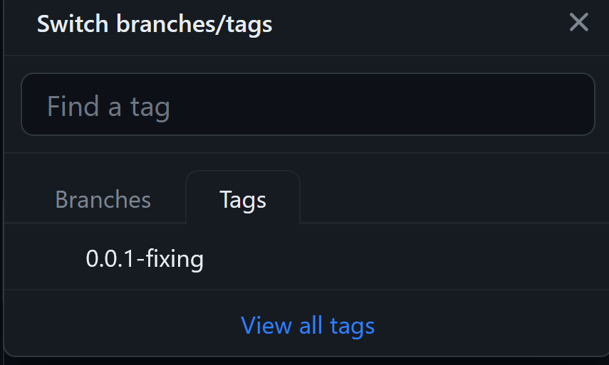

# Terraform Beginner Bootcamp 2023 - Week 0 Notes and Documentation
https://terraformcloudbootcamp.notaku.site/week-o
- I use Notion for note taking.
- Notaku is a service that allows you to convert your Notion notes into a viewable webpage.
- The link above is the link to the Notaku page for this week's notes.


## Week 0 Overview
This week focused on initial setup and environment configuration. Tasks completed include:
- **Create GitHub Account**
- **Create TFC Account**
- **Getting Started with GitPod**
- **Creating Bash Scripts for GitPod**
- **Creating S3 Bucket using Terraform**
- **Using Terraform Random Provider**
- **Using the Project Validator**

---

# Expectations of a Cloud Engineer

## Professional Expectations

- Uphold the responsibilities and tasks commonly expected of cloud engineers.

### Key Principles

#### Embrace Feedback
- **Feedback as a Growth Mechanism**: Utilize feedback for professional growth in cloud engineering.
  - 💡 **Tip**: Handle feedback gracefully.

#### Practice Thoughtfulness
- **Consideration in Assistance**: Evaluate the necessity and impact when asking for help.
  - 💡 **Tip**: Research before asking and take notes to show effort.

#### Uphold Conduct
- **Code of Conduct**: Abide by universal codes of conduct; personal codes do not override them.

#### Prioritize Self-Reliance
- **Resourcefulness**: Consult documentation and FAQs before seeking further guidance.
  - 💡 **Tip**: Always read manuals and online documentation.

#### Show Effort
- **Problem-Solving**: Attempt to solve issues independently before seeking help.

#### Teamwork
- **Avoid Silos**: Collaborate and follow established standards.
  - 💡 **Tip**: Solutions should benefit the entire team, not just an individual.

## Asking Good Questions
- **Discord Channels**: Use the correct section under `help forums` and tag your questions.
- **Markdown Support**: Include as much detail as possible using markdown.

---

# GitHub Flavored Markdown (GFM)

## Documentation Essentials
- **Mandatory Documentation**: Ensure a consistent level of documentation.
- **Notion to GitHub**: Export Notion notes to markdown and upload them to GitHub.

### GFM Features
- **Enhanced Markdown**: GFM offers additional features over standard Markdown.
  - **Images**: Use Markdown or HTML syntax for images.
  - **Text Formatting**: Use `__bold__` or `**bold**` for bold text.
  - **Emojis**: Use `:cloud:` to display a cloud emoji.
  - **Tables**: Various table formatting options are available.
  - **Anchors**: Create page-specific anchors and hyperlinks.
  - **Image Referencing**: Use local paths for images.

---

# GitPod Setup Guide

## Sign-Up and Configuration
- **Step 1**: Sign up for GitPod and link your GitHub account.
- **Step 2**: Configure your workspace settings.


## Workspace Usage
- **Step 3**: Launch and use the workspace like a local environment.

- **Step 4**: Sync your repository using `git pull`.


---

# GitHub Project Template

## Using GitHub Templates
- **Template Feature**: GitHub allows you to use repositories as templates.
  - 🚨 **Note**: The name must be the same for validation purposes.


### Debugging and Troubleshooting Checklist

1. **Did you use LLMs to research the issue?**
    1. What did you find?
    2. What do you think the issue is?

2. **Did you try and debug the issue?**  
   _Show what steps you have taken to debug and troubleshoot._

3. **Did you provide screenshots?**

4. **Did you provide a code example?**
    1. Did you use a code block?
    2. Did you use syntax highlighting?

5. **Did you commit code to a working branch?**
    1. _Did you share your working branch so we can investigate the code?_

6. **Before helping other boot campers**  
   _Guide them to it, do **not** give them the answer._

### Why This Matters
- **Clarity**: Proper formatting makes it easier to understand the checklist.
- **Efficiency**: A well-organized list saves time, especially when you're debugging or troubleshooting, which is crucial in your role as a Cloud Engineer. 🛠️

## GitHub Flavoured Markdown
> Only took notes of features I didn't know or was unsure of

### Documentation Essentials with GitHub Flavored Markdown

#### Hard Requirement for Documentation
- **Mandatory**: Ensure some level of documentation is maintained.

#### Notion to GitHub
- **Export & Upload**: Convert Notion notes to markdown and upload to GitHub.

---

#### GitHub Flavored Markdown (GFM)
- **Enhanced Features**: Offers more than standard Markdown.

#### Images
- **Markdown Syntax**: 
  ```jsx
  
  ```
- **HTML Syntax**: Allows size specification.
  ```jsx
  ")
  ```

#### Text Formatting
- **Bold Text**: 
  ```jsx
  __bold__
  **bold**
  ```

#### Emojis
- **Emoji Support**: 
  ```jsx
  :cloud: -> Shows a cloud emoji!
  ```

#### Tables
- **Variety**: Multiple table formatting options.
- **Reference**: [GitHub Flavored Markdown Spec](https://github.github.com/gfm/)
  - 💡 **See 4.10 Tables (extension)** for table formatting details.

#### Anchors & Hyperlinks
- **Page-Specific Anchors**: 
  ```jsx
  [see references below](#external-references)
  ## External References
  ```
  - 💡 **Note**: Headings are lowercased and spaces are replaced with `-`.

#### Image Referencing
- **Local Paths**: 
  ```jsx
  
  ```
- **Preferred Method**: Use a folder in your GitHub repo for images.

### Why This Matters
- **Consistency**: Uniform documentation enhances readability and maintainability.
- **Efficiency**: Knowing these Markdown features can speed up your documentation process, which is a key skill for a Cloud Engineer. 🌩️


### How to Sign Up for GitPod and Get Started

#### Sign-Up & GitHub Linking
- **Step 1**: Sign up for GitPod.
- **Step 2**: Link your GitHub account during the signup process.

#### Workspace Configuration
- **Step 3**: Log in to GitPod and click `create new workspace`.
  - **Git Repo**: Choose the repository you want to work on.
  - **Editor**: Select your preferred code editor.
  - **Machine Size**: Pick the machine size that suits your needs.


#### Launch & Use Workspace
- **Step 4**: Once the workspace launches, a VSCode environment will open in your browser.
  - **Local-Like Experience**: Use it as if it's installed on your computer.
  - **Commit Changes**: Don't forget to commit before closing the workspace.


#### Syncing Repo
- **Step 5**: Perform a `git pull` to sync GitPod with the latest version of your repository.


### Why This Matters
- **Convenience**: GitPod offers an on-the-go coding environment, accessible from any device.
- **Efficiency**: The setup saves you the hassle of local environment configurations, which is a time-saver for a busy Cloud Engineer like you. 🌩️


# Copying the Template GitHub Project Repo


GitHub as a `template` feature that allows you to `Fork` repos and use that repo as a template!

- This is preferred method instead of forking it!

<aside>
🚨 The name MUST be the same!

There are validators that require this name to be the same!


# Branching, Tagging, and Pull Requests

## How to Tag in GitHub

- **Tagging Syntax**: Use `git tag <tag>` to create a new tag.
- **Pushing Tags**: Use `git push --tags` to push the tag to GitHub.

```bash
gitpod /workspace/terraform-beginner-bootcamp-2023 (main) $ git tag 0.0.1-fixing
gitpod /workspace/terraform-beginner-bootcamp-2023 (main) $ git push --tags
```



- **Tag Creation**: The tag is now created within the GitHub CLI.


<aside>
⚠️ **Note**: Creating a tag does not create a GitHub release. A release can be created from the tag using the button on the top right of the screenshot.
</aside>


---

## How to Create Issues and Branches in GitHub

- **Issue Numbering**: Each GitHub issue is assigned a unique number (e.g., `#1`).

<aside>
💡 **Tip**: You can create a new branch directly from the issue page. This branch will be automatically linked to the issue, enabling better tracking and auto-closing of issues when merged to the main branch.
</aside>

=


<aside>
💡 **Tip**: The new branch will have the issue number at the beginning of its name.
</aside>


- **Commit Linking**: Use the issue number in your commits to track them against the issue.


- **Pull Requests**: When creating a Pull Request, it will be linked to the issue if the branch was created from that issue.


<aside>
💡 **Best Practice**: Use `squash and merge` to consolidate commits into a single commit for a cleaner history.
</aside>

- **Auto-Closing Issues**: Merging the Pull Request will automatically close the linked issue.


- **Issue and PR Linking**: Hovering over `#1` will show the linked issue and the actual pull request.


